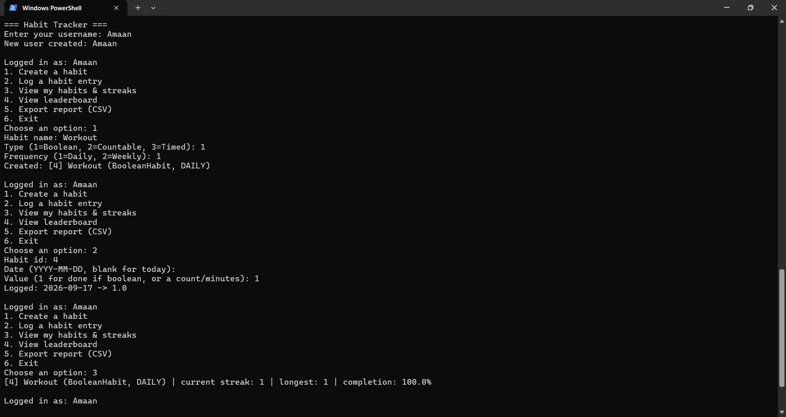
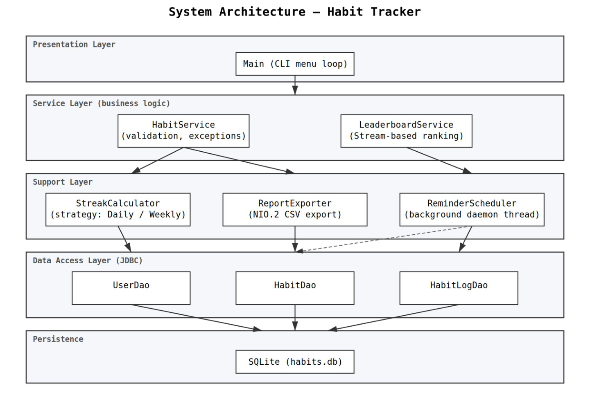

# Habit Tracker with Streak Analytics & Social Leaderboard

A command-line Java application for tracking daily/weekly habits, computing streaks and completion rates, and ranking users on a leaderboard. Built for the "Programming in Java" course project.

## Overview

Users create habits of three kinds — simple done/not-done habits, countable habits (e.g. "8 glasses of water"), and timed habits (e.g. "30 minutes of exercise") — and log daily progress against them. The app computes current and longest streaks, completion rates, and a cross-user leaderboard, all persisted to a local SQLite database. A background thread periodically reminds the console user of any habit not yet logged for the day.

## Features

- Three habit types (Boolean, Countable, Timed) via an OOP class hierarchy
- Current streak, longest streak, and completion rate analytics using Java Streams
- Cross-user leaderboard ranking
- Persistent storage via JDBC + SQLite (no server setup required)
- Background reminder thread using `ScheduledExecutorService`
- CSV report export using NIO.2 (`java.nio.file`)
- Custom checked exceptions for duplicate log entries and invalid habit targets
- JUnit 5 test suite

## Technologies Used

- Java 17+ (developed and tested on JDK 25)
- Maven (build tool)
- SQLite via the `sqlite-jdbc` driver (embedded, file-based — no database server needed)
- JUnit 5 (testing)

## Prerequisites

- **JDK 17 or higher** — verify with `java -version`
- **Maven 3.8+** — verify with `mvn -version`
- **Git** — to clone the repository

No separate database installation is required. SQLite runs as a single local file (`habits.db`), created automatically the first time the app runs.

## Setup & Installation

1. Clone the repository:

```
git clone https://github.com/amaan0712/habit-tracker.git
cd habit-tracker
```

2. Compile the project (this also downloads all dependencies automatically):

```
mvn clean compile
```

3. Run the test suite (optional but recommended):

```
mvn test
```

## Running the Application

From the project root:

```
mvn compile exec:java
```

On first run, this creates `habits.db` in the project root automatically — no manual database setup needed.

Alternatively, build a runnable JAR and launch it directly:

```
mvn clean package
java -jar target/habit-tracker-1.0.0.jar
```

## Usage

1. On startup, enter a username. If it doesn't exist yet, a new account is created automatically; if it does, you're logged in.
2. From the menu, create habits, log daily entries, view your streaks, check the leaderboard, or export a CSV report.
3. A background reminder checks every 5 minutes for any habit not yet logged today and prints a notice to the console (this interval is intentionally short for demo purposes; a real deployment would check once every 24 hours).
4. Choose "Exit" from the menu to shut down cleanly.

## Testing

Run:

```
mvn test
```

This runs the JUnit 5 suite covering streak calculation logic (current streak, longest streak, handling gaps and incomplete entries) and habit creation validation (rejecting non-positive targets).

## Project Structure

```
habit-tracker/
├── pom.xml
├── schema.sql
├── README.md
├── statement.md
├── docs/             Design diagrams (architecture, use case, workflow,
│                     class, sequence, ER)
└── src/
    ├── main/java/com/habittracker/
    │   ├── model/        Habit hierarchy, User, LogEntry
    │   ├── exception/    Custom checked exceptions
    │   ├── streak/       Streak calculation strategies
    │   ├── service/      HabitService, LeaderboardService
    │   ├── dao/          JDBC data access objects
    │   ├── concurrency/  Background reminder scheduler
    │   ├── io/           NIO.2-based CSV report export
    │   └── cli/          Main entry point / menu
    └── test/java/com/habittracker/
        ├── streak/
        └── service/
```

## Screenshots

A full CLI session — user login, creating a habit, logging an entry, and viewing the resulting streak:



## Design Diagrams

Full design diagrams are available in the `docs/` folder:

- System Architecture Diagram — layered structure from the CLI down to SQLite
- Use Case Diagram — everything a user (and the background reminder) can do
- Workflow / Process Flow Diagram — the application's runtime lifecycle
- Class Diagram — the Habit OOP hierarchy and its relationships
- Sequence Diagram — the full flow of logging a habit entry
- ER Diagram — the three-table SQLite schema


## Future Enhancements

- Weekly aggregate view showing a full week's completion grid
- Multi-user concurrent sessions
- Export to additional formats (JSON, PDF)
- Configurable reminder times per habit

## Author

Amaan Farooqui
GitHub: [amaan0712](https://github.com/amaan0712)

Built as a course project for "Programming in Java," demonstrating object-oriented design, custom exception handling, the Collections/Streams API, JDBC persistence, and concurrency in a single cohesive Java application.
